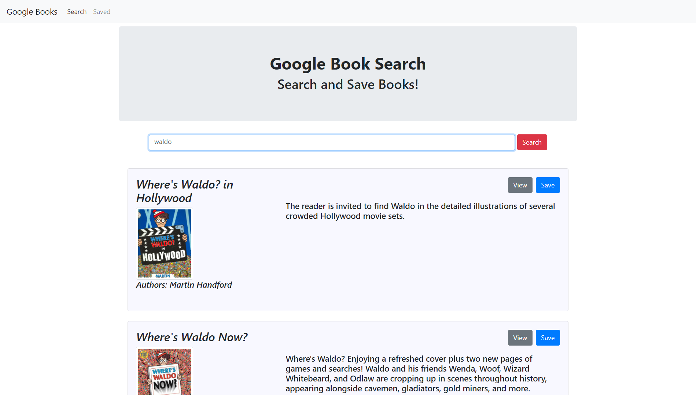
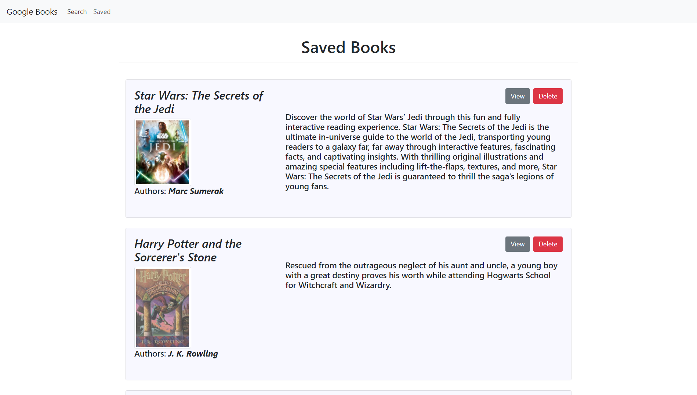

## Google Book Search (React App)

 
 
---

 

* As a user, I want to be able to search and save books that i am interested in.

The user will be able to:

  * Search the name of a book, resulting with the title, poster image, author, and description.

  * Each book result will also have links for the google page store, save, and delete.

  * Saving the book will remove the book from the main page list and place it in the Saved page list where you can view them there and delete.

This project was bootstrapped with [Create React App](https://github.com/facebook/create-react-app).

## Technology

-MERN
-Express
-Axios
-React
-JSX
-Node
-Mongoose
-Heroku

## Install

Clone the repo.
 
Start up your MongoDB.
 
In the project directory, you can run: 
 

### 'npm install'

 
and then:
 

### `npm start`

Open [http://localhost:3000](http://localhost:3000) to view it in the browser.

## Learn More

You can learn more in the [Create React App documentation](https://facebook.github.io/create-react-app/docs/getting-started).

To learn React, check out the [React documentation](https://reactjs.org/).

### Deployment

The app is currently deployed via Heroku here:
